# 显示器管理架构设计文档

## 目录

- [现状分析](#现状分析)
- [当前架构](#当前架构)
- [设计缺陷](#设计缺陷)
- [重构目标架构](#重构目标架构)
- [模块设计](#模块设计)
- [会话生命周期](#会话生命周期)
- [实施计划](#实施计划)

---

## 现状分析

### 当前数据流

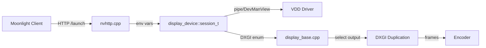

### 当前文件分布

| 文件 | 职责 |
|------|------|
| `src/nvhttp.cpp` | 解析客户端请求、构建 launch_session |
| `src/display_device/vdd_utils.cpp` | VDD 驱动控制(pipe IPC + DevManView) |
| `src/platform/windows/display_base.cpp` | DXGI 枚举、显示器选择、分辨率检测 |
| `src/platform/windows/display.h` | 显示器元数据(旋转/色彩空间/格式) |
| `src/config.cpp` | `config::video.output_name` 服务端配置 |

---

## 当前架构

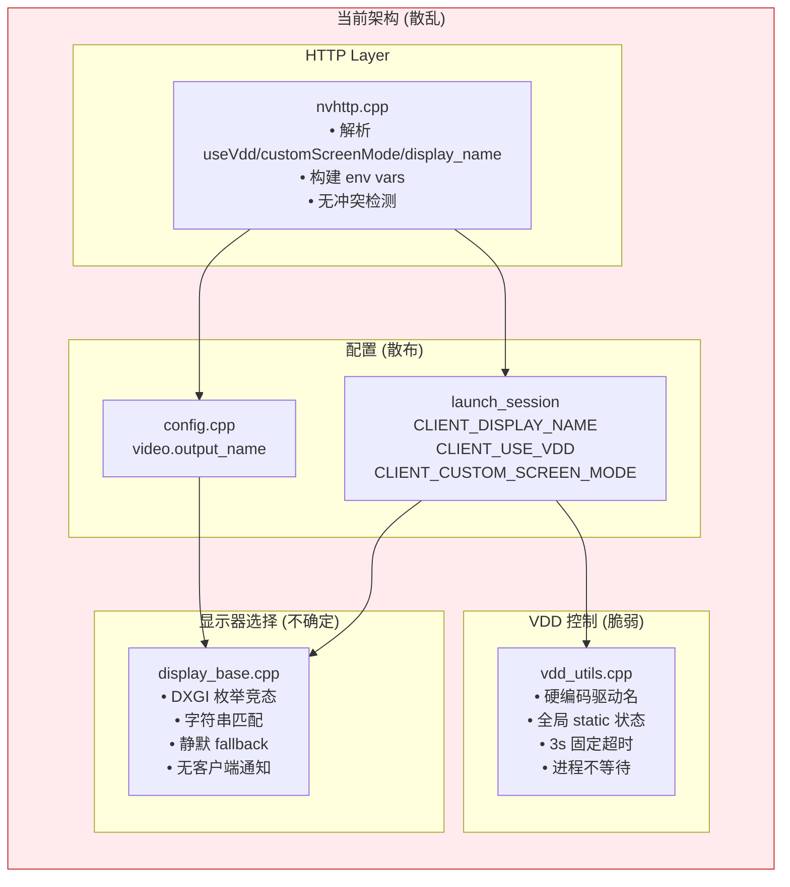

---

## 设计缺陷

### 缺陷列表

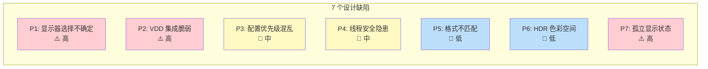

### 缺陷详情

#### P1: 显示器选择不确定性

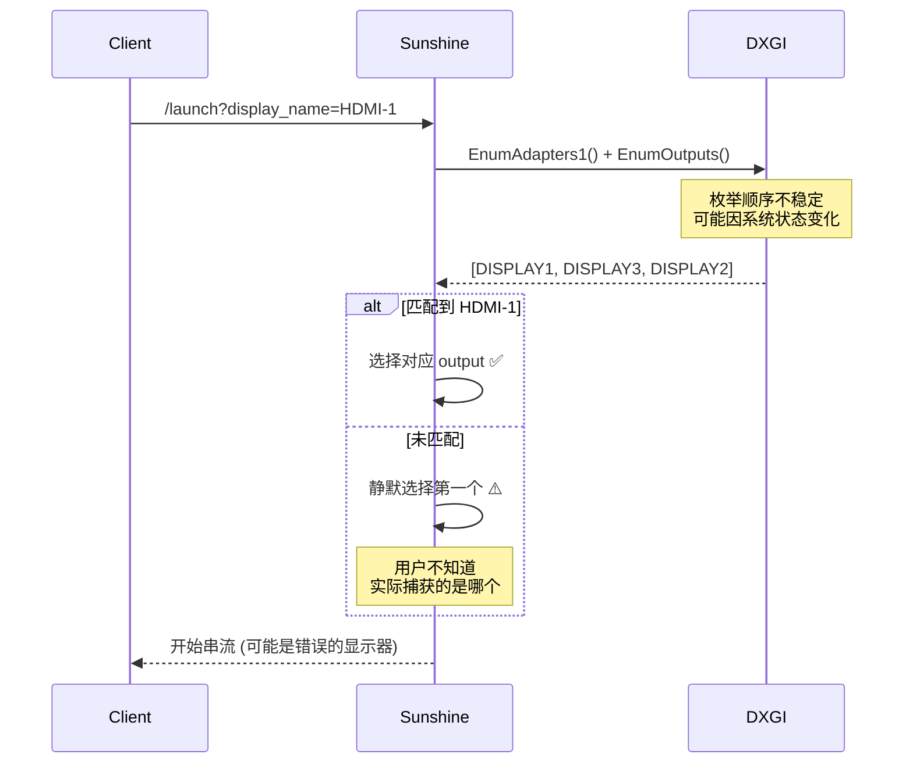

#### P2: VDD 控制流程问题

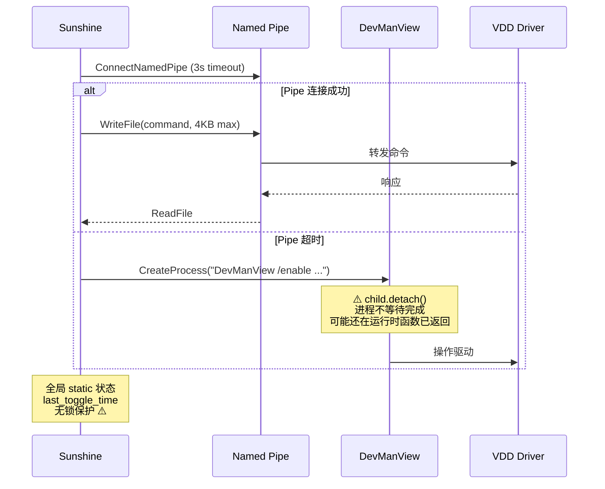

#### P7: 崩溃后孤立状态

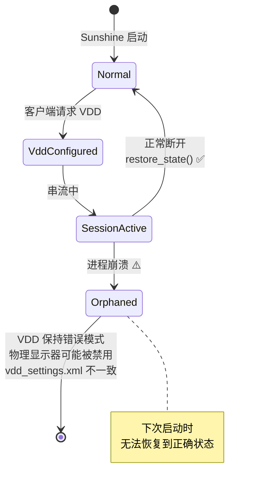

---

## 重构目标架构

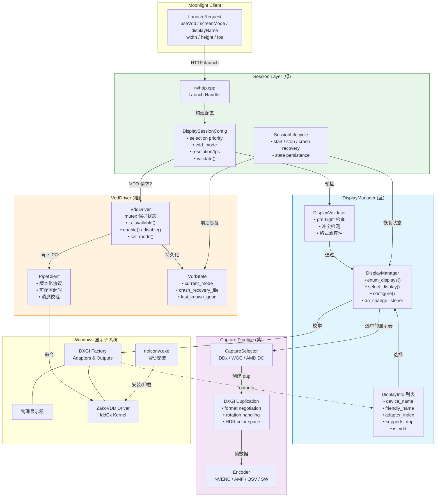

---

## 模块设计

### DisplaySessionConfig — 配置合并

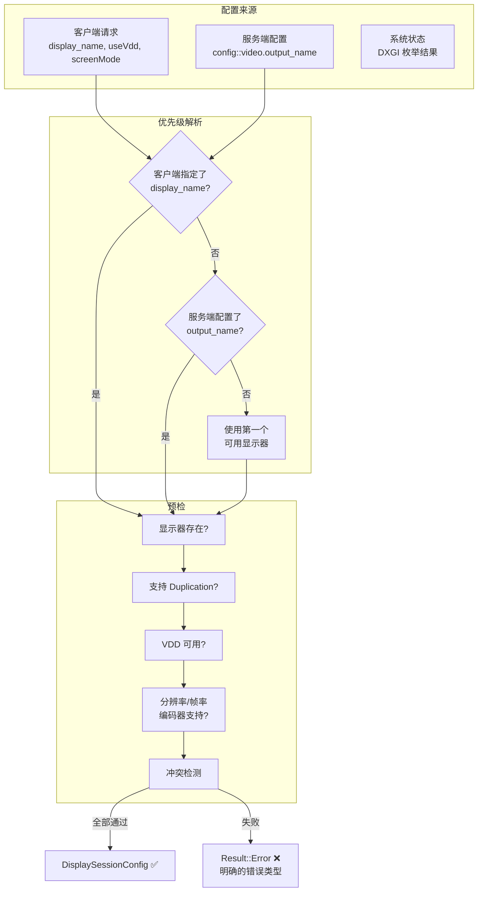

### VddDriver — 状态机

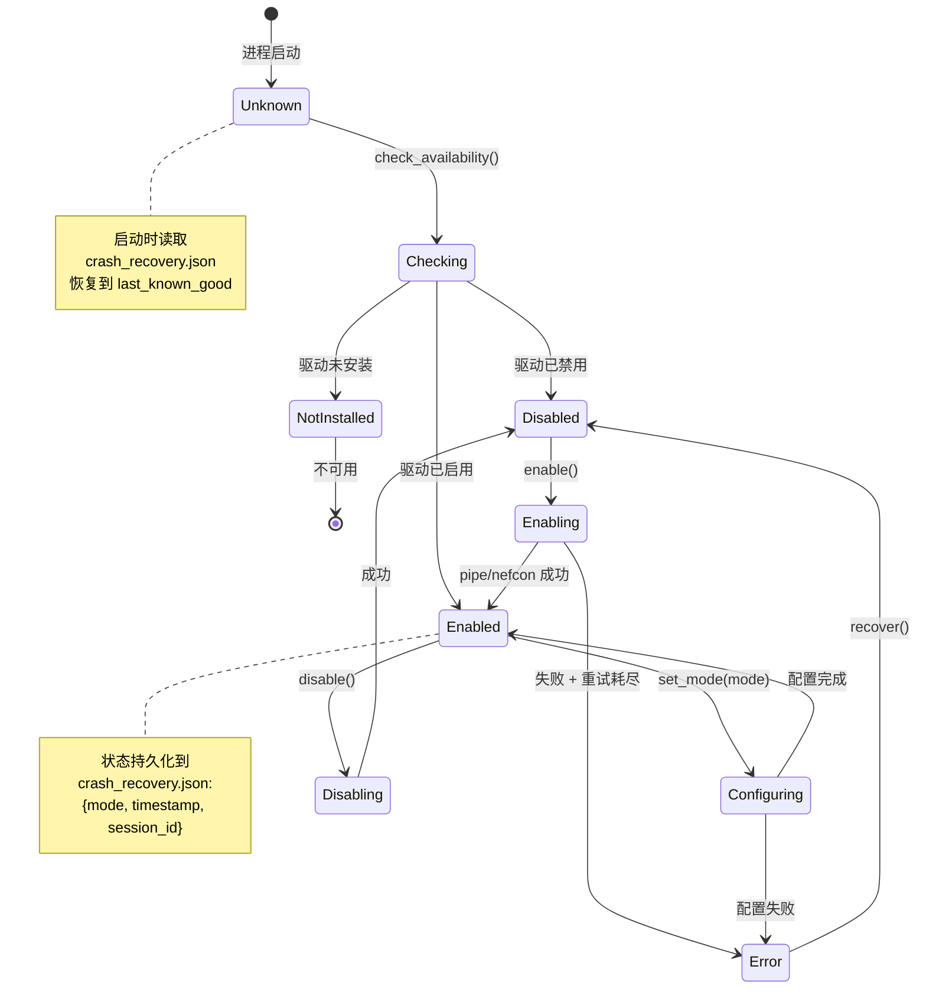

### DisplayManager — 变更检测

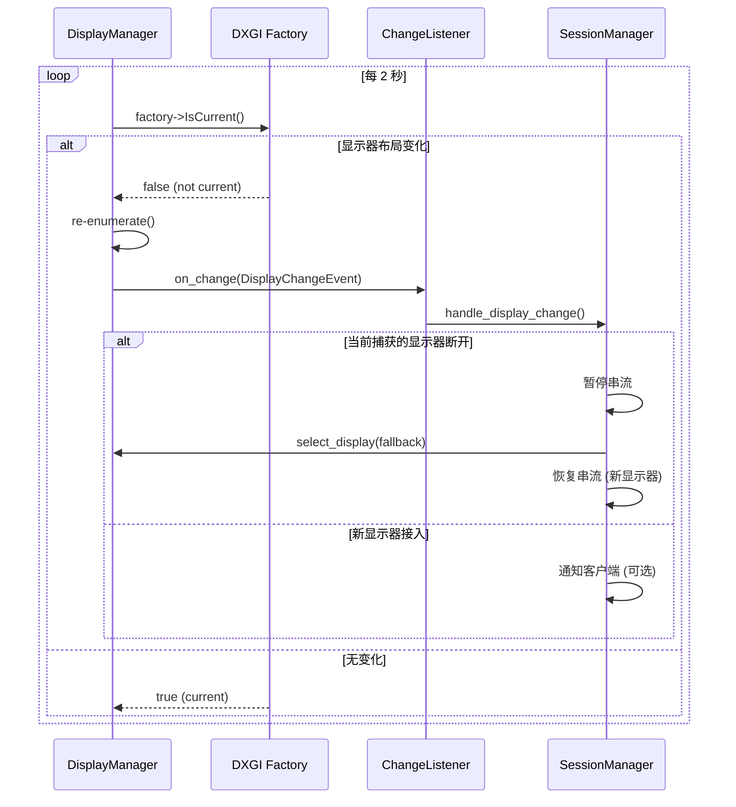

---

## 会话生命周期

### 正常流程

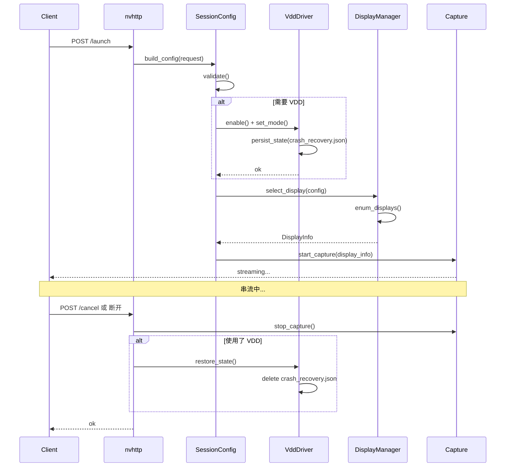

### 崩溃恢复流程

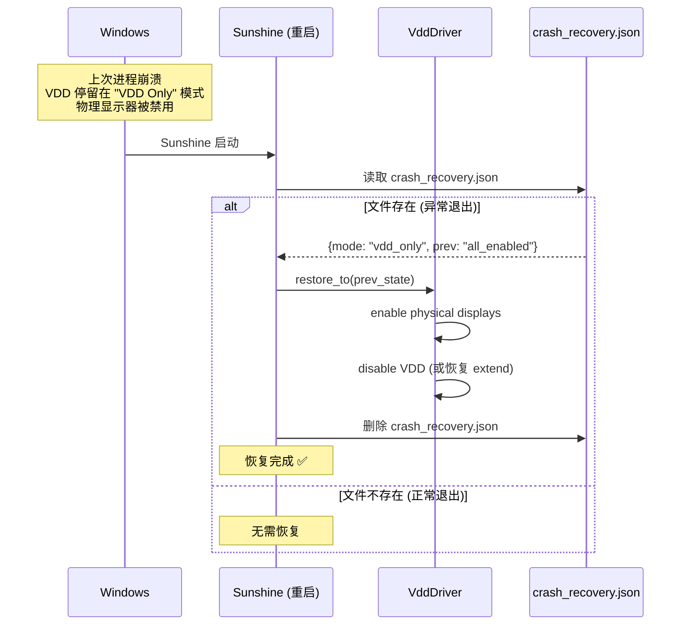

---

## 实施计划

### 分阶段重构

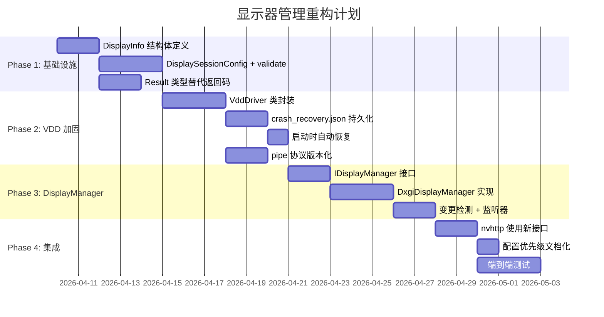

### 优先级

| 优先级 | 改动 | 影响 | 风险 |
|--------|------|------|------|
| P0 | VDD 崩溃恢复 (P7) | 用户体验直接影响 | 低 |
| P1 | VDD 驱动封装 (P2) | 消除全局状态/进程泄漏 | 中 |
| P2 | 配置优先级统一 (P3) | 消除配置歧义 | 低 |
| P3 | 线程安全 (P4) | 并发会话 | 中 |
| P4 | DisplayManager 抽象 (P1) | 架构改善 | 高 (改动面大) |

---

## restore_state_impl 完整场景覆盖

### 决策流程图

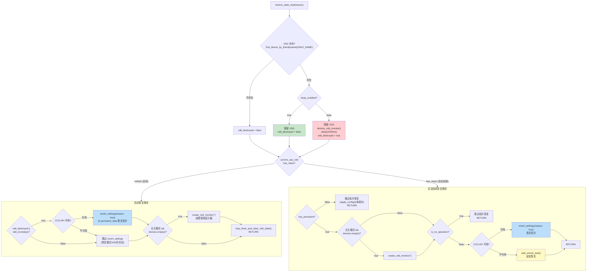

### 场景矩阵

```mermaid
graph LR
    subgraph Scenarios["11 个场景完整覆盖"]
        S1["#1 启动/无VDD<br/>revert no-op → return"]
        S2["#2 启动/VDD/!keep<br/>销毁 → revert → return"]
        S3["#3 启动/VDD/keep<br/>保留 → skip revert → return"]
        S4["#4 结束/无VDD/persistent<br/>→ revert"]
        S5["#5 结束/VDD/!keep/persistent<br/>销毁 → revert"]
        S6["#6 结束/VDD/keep/persistent<br/>保留 → revert"]
        S7["#7 结束/VDD/!keep/!persistent<br/>销毁 → 跳过拓扑"]
        S8["#8 结束/无VDD/!persistent<br/>→ 跳过拓扑"]
        S9["#9 结束/no_operation<br/>→ 跳过拓扑"]
        S10["#10 结束/CCD锁定<br/>→ 延迟重试"]
        S11["#11 启动/VDD/CCD锁定<br/>销毁 → skip revert"]
    end
    
    style S2 fill:#e3f2fd
    style S5 fill:#e3f2fd
    style S10 fill:#fff9c4
    style S11 fill:#fff9c4
```

### 配置优先级

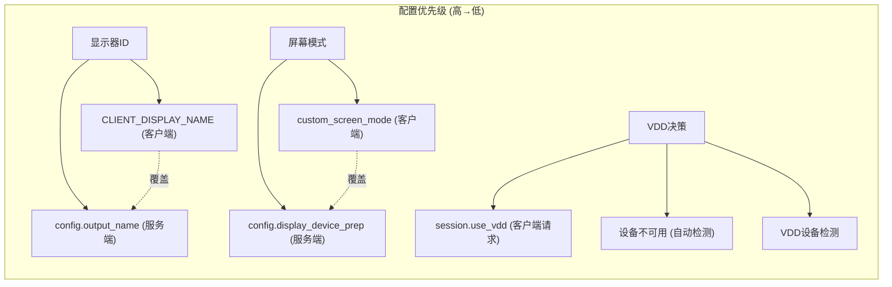
