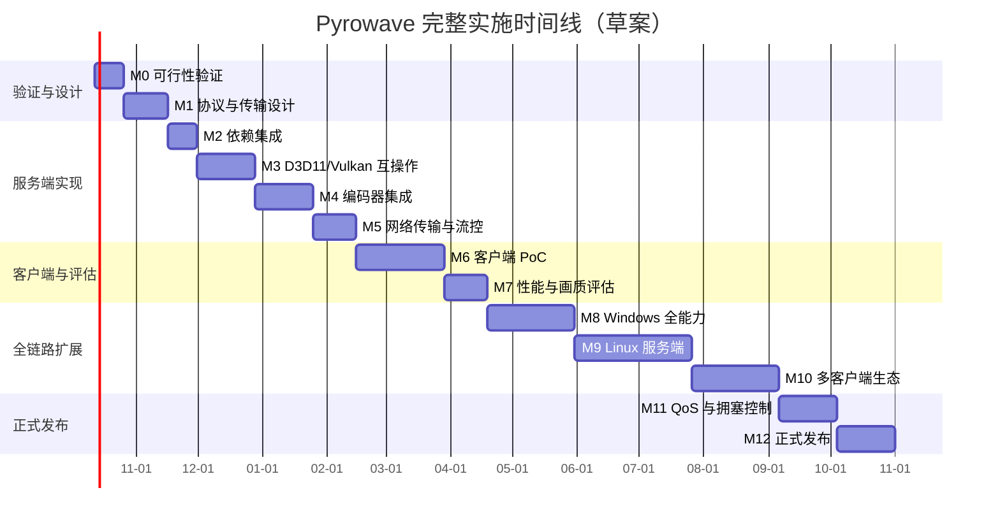

# Pyrowave Codec 实施路线图

日期：2026-09-27  
状态：草案  
前置研究：[Pyrowave 与 Foundation Sunshine 集成研究报告](./pyrowave_sunshine_research.md)

## 1. 背景与目标

Pyrowave 是基于 Vulkan Compute Shader 的帧内编码方案，具有极低编解码延迟的优势，但带宽消耗显著高于现有视频格式。本路线图的目标是在 Foundation Sunshine 中评估并实现 Pyrowave 作为实验性编码选项，以在有线千兆局域网中进一步降低串流延迟。

本路线图的目标是：

- 定义一条可评估、可验证、可回退的实验性实施路径；
- 明确协议扩展、GPU 互操作、客户端适配、测试和安全边界；
- 控制对现有 H.264、HEVC 和 AV1 链路的侵入范围；
- 在性能收益得到证实之前，不将 Pyrowave 作为默认或稳定功能。

本路线图分为五个阶段推进：PoC 验证、Windows 全能力、Linux 服务端、多客户端生态、正式发布。各阶段范围见第 6 节。

第一阶段（PoC）的目标范围冻结为：

| 维度 | 首版范围 |
|---|---|
| 服务端平台 | Windows |
| GPU 拓扑 | 单 GPU |
| 捕获路径 | D3D11 捕获 |
| 编码输入 | Vulkan 导入 |
| 色彩空间 | SDR，BT.709 |
| 色度采样 | YUV 4:2:0 |
| 位深 | 8-bit |
| 分辨率与帧率 | 1080p60 |
| 客户端 | 单一可控客户端 |
| 网络 | 千兆有线 |
| 默认状态 | 关闭 |
| 兼容策略 | 自动回退到 H.264/HEVC/AV1 |

最终目标是让 Pyrowave 成为 Foundation Sunshine 在高带宽有线局域网场景下的正式可选编码格式，覆盖完整链路和主流平台：

| 维度 | 最终目标 |
|---|---|
| 服务端平台 | Windows、Linux |
| GPU 拓扑 | 单 GPU、混合 GPU、多 GPU |
| 捕获路径 | D3D11（DDX/WGC/VDD）、Wayland、KMS、CUDA |
| 色彩空间 | SDR、HDR10、HLG |
| 色度采样 | 4:2:0、4:2:2、4:4:4 |
| 位深 | 8-bit、10-bit |
| 分辨率 | 最高 4K |
| 帧率 | 最高 240 FPS |
| 客户端 | PC、Android、HarmonyOS、iOS |
| 网络 | 有线千兆及以上 |
| 稳定性 | 正式版可选，默认仍为关闭 |

## 2. 参考资料与公开规范

### 2.1 Pyrowave 上游项目

- [Themaister/pyrowave](https://github.com/Themaister/pyrowave)  
  Pyrowave 编解码器核心实现，包含 Vulkan Compute Shader 编解码路径。
- [Pyrowave bitstream 草案](https://github.com/Themaister/pyrowave/blob/master/bitstream/bitstream.md)  
  帧级和区块级语法草案。该文档明确处于 draft 状态，格式可能随版本变更。
- [Themaister/pyrofling](https://github.com/Themaister/pyrofling)  
  基于 `pyro://` 的参考传输实现，包含服务端、PC 客户端和实验性 Android 代码。
- [Steam Remote Play：Pyrowave video codec now in beta](https://steamcommunity.com/groups/homestream/discussions/0/564794422009744473)  
  Steam 官方公告，说明目标带宽为 100–500 Mbps，推荐千兆有线网络。

### 2.2 RTP 与视频传输规范

Pyrowave 本身目前没有标准化的 IETF RTP payload 映射，这一点是协议设计的核心约束。以下是现有 Moonlight 视频格式使用的公开规范，可作为分片、重组和时序设计的参考：

- [RFC 3550](https://datatracker.ietf.org/doc/html/rfc3550) — RTP 基础协议；
- [RFC 6184](https://datatracker.ietf.org/doc/html/rfc6184) — H.264 RTP payload；
- [RFC 7798](https://datatracker.ietf.org/doc/html/rfc7798) — HEVC RTP payload；
- [RFC 7741](https://datatracker.ietf.org/doc/html/rfc7741) — VP8 RTP payload；
- [AOMediaCodec AV1 RTP Specification](https://aomediacodec.github.io/av1-rtp-spec/) — AV1 RTP payload。

Pyrowave 的 RTP 映射必须作为私有扩展单独设计，不能复用上述任何一种 payload 格式。

## 3. Foundation Sunshine 现有能力评估

### 3.1 已具备的基础

- Moonlight 协议层已有 H.264、HEVC、AV1 的视频格式协商框架；
- Windows 平台已有 DDX、WGC、VDD 等 D3D11 捕获路径；
- 捕获纹理以 `ID3D11Texture2D` 形式驻留显存，支持 `SHARED_NTHANDLE` 和 `KEYEDMUTEX`；
- 代码中存在 Vulkan 编码器描述，具备一定的 Vulkan 设备管理基础；
- 服务端已有编码器自动选择与回退机制。

### 3.2 缺失的关键能力

| 能力项 | 当前状态 |
|---|---|
| Pyrowave 依赖管理 | 未集成 |
| 编码器接口适配 | 未实现 |
| D3D11 → Vulkan 外部内存导入 | 未验证 |
| D3D11 / Vulkan 外部同步 | 未验证 |
| 视频格式协商扩展 | 未实现 |
| RTP 分片与重组协议 | 未定义 |
| 客户端解码路径 | 未实现 |
| HDR / 4:4:4 / 10-bit 格式扩展 | 未实现 |
| Linux 捕获 → Vulkan 路径 | 未验证 |
| 混合 GPU 适配器匹配 | 未实现 |
| 拥塞控制与自适应码率 | 未实现 |
| 多客户端解码适配 | 未实现 |
| 性能采集与对比基准 | 未建立 |
| 性能评估报告模板 | 未建立 |
| 模糊测试与安全审计 | 未开始 |

### 3.3 与现有 Vulkan 能力的关系

仓库中已有的 FFmpeg Vulkan encoder 定义（`h264_vulkan`、`hevc_vulkan`、`av1_vulkan`）与 Pyrowave 所需能力不同。前者通过 FFmpeg 管理 Vulkan 设备和编码流程，而 Pyrowave 需要直接持有 `VkImage` 和 `VkDevice`，并使用 Compute Shader 执行小波变换和熵编码。因此 Pyrowave 不能通过扩展现有 encoder 配置项来实现，需要独立的资源导入层和编码封装。

Windows Vulkan HDR Bridge 仅用于 ZakoVDD 的 Vulkan 应用 HDR 呈现兼容，与屏幕捕获和视频编码无关，不能作为 Pyrowave 的互操作基础。

## 4. 目标架构与全链路

Pyrowave 集成涉及从屏幕捕获到客户端呈现的完整视频链路。任何一环缺失都会导致功能不可用或性能退化。

### 4.1 端到端数据流

```text
┌─────────────────────────── 服务端 ───────────────────────────┐
│                                                              │
│  屏幕捕获          格式转换          GPU 互操作     编码      │
│  ┌─────────┐      ┌─────────┐      ┌─────────┐   ┌───────┐ │
│  │ DDX     │      │ BGRA→  │      │ D3D11→  │   │Pyrowave│ │
│  │ WGC     ├─────→│ NV12 / │─────→│ Vulkan  ├──→│Compute │ │
│  │ VDD     │      │ P010 / │      │ Import  │   │Encode  │ │
│  │ Wayland │      │ RGBA16 │      │ Sync    │   └───┬───┘ │
│  │ KMS     │      └─────────┘      └─────────┘       │     │
│  └─────────┘                                         │     │
│                                                      ▼     │
│  配置管理      会话管理          流控           RTP 分片    │
│  ┌───────┐    ┌───────┐      ┌───────┐     ┌───────┐   │
│  │Config │    │Session│      │  QoS  │     │Packet-│   │
│  │WebUI  │    │Lifecycle│    │Congest│     │  ize  │   │
│  └───────┘    └───────┘      └───────┘     └───┬───┘   │
│                                                   │       │
└───────────────────────────────────────────────────┼───────┘
                                                    │ UDP/RTP
                                                    ▼
┌─────────────────────────── 客户端 ──────────────────────────┐
│                                                              │
│  RTP 重组         Pyrowave 解码       格式转换      渲染呈现 │
│  ┌─────────┐      ┌─────────┐      ┌─────────┐   ┌───────┐ │
│  │Depacket-│      │Vulkan   │      │YUV→RGB │   │Swapchain│ │
│  │  ize    ├─────→│Compute  ├─────→│HDR tone├──→│Present │ │
│  │Reassembly│     │Decode   │      │  map   │   └───────┘ │
│  └─────────┘      └─────────┘      └─────────┘            │
│                                                              │
│  能力协商       探针上报         回退处理      输入通道      │
│  ┌───────┐    ┌───────┐      ┌───────┐    ┌───────┐      │
│  │RTSP   │    │Probe  │      │Fallback│   │Input  │      │
│  │Negotiate│   │Report │      │Logic  │    │Channel│      │
│  └───────┘    └───────┘      └───────┘    └───────┘      │
└──────────────────────────────────────────────────────────────┘
```

### 4.2 服务端链路

| 环节 | Windows 路径 | Linux 路径 | 状态 |
|---|---|---|---|
| 屏幕捕获 | DDX / WGC / VDD → `ID3D11Texture2D` | Wayland / KMS / CUDA | 已有 |
| 像素格式 | BGRA / NV12 / P010 | NV12 / P010 / RGBA16 | 已有 |
| 色彩空间 | SDR BT.709 / HDR BT.2020 PQ | 同左 | 已有 |
| GPU 互操作 | D3D11 → Vulkan external memory | EGL / CUDA → Vulkan | 待实现 |
| GPU 同步 | Keyed Mutex → external semaphore | Fence / semaphore | 待实现 |
| 编码 | Pyrowave Vulkan Compute | 同左 | 待实现 |
| 分片 | RTP payload 私有扩展 | 同左 | 待设计 |
| 流控 | 带宽反馈 + 拥塞控制 | 同左 | 待设计 |
| 会话管理 | RTSP session 绑定 | 同左 | 待实现 |
| 配置管理 | sunshine.conf + Web UI | 同左 | 待实现 |
| 探针 | 逐帧时间戳 + 计数器 | 同左 | 待实现 |

### 4.3 客户端链路

| 环节 | PC 客户端 | Android 客户端 | 移动客户端 | 状态 |
|---|---|---|---|---|
| 能力协商 | RTSP 私有字段 | 同左 | 同左 | 待实现 |
| RTP 重组 | VideoDepacketizer 扩展 | 同左 | 同左 | 待实现 |
| 解码 | Vulkan Compute | Vulkan Compute | Metal / Vulkan 子集 | 待实现 |
| 格式转换 | Compute Shader YUV→RGB | 同左 | Shader 变体 | 待实现 |
| HDR 呈现 | Swapchain HDR metadata | HDR display API | HDR support | 待实现 |
| 渲染 | D3D11 / Vulkan / OpenGL | Vulkan / GLES | Metal | 已有 |
| 回退 | 自动切换现有格式 | 同左 | 同左 | 待实现 |
| 探针 | 逐帧时间戳 | 同左 | 同左 | 待实现 |

### 4.4 协议层

| 层级 | 现有能力 | Pyrowave 扩展 |
|---|---|---|
| RTSP 能力协商 | H.264 / HEVC / AV1 codec ID | 新增私有 codec ID + 版本字段 |
| 视频参数 | 分辨率、帧率、码率 | 新增色度采样、位深、色彩空间 |
| RTP payload | 各格式独立分片规则 | 新增 Pyrowave 私有分片格式 |
| 丢包恢复 | 参考帧编码 / IDR 刷新 | 帧内编码，下一完整帧覆盖 |
| FEC | Reed-Solomon | 兼容现有 FEC，评估开销 |
| 加密 | AES-128 / AES-256 | 透传，不改变加密层 |
| 拥塞控制 | 带宽估计 + 码率调整 | 高码率下的专用策略 |

### 4.5 安全与生命周期

| 环节 | 要求 |
|---|---|
| 输入解析 | 所有网络数据视为不可信，严格边界检查 |
| 加密兼容 | 不破坏现有 AES 加密层，密文损坏需安全处理 |
| 会话生命周期 | RTSP 会话创建、Resume、断开、超时全路径资源回收 |
| 显示器生命周期 | VDD 创建 / 销毁 / 切换时编码器正确处理 |
| GPU 生命周期 | 设备丢失 / 驱动重置时自动回退 |
| 多客户端并发 | 多会话同时串流时资源隔离 |
| 服务重启 | sunshinesvc 重启后状态一致 |
| 模糊测试 | 分片解析器全量 fuzz，无越界 / 崩溃 / 死循环 |

## 5. 设计原则

1. **实验性可选启用**  
   Pyrowave 必须通过显式配置开启，默认关闭。任何失败路径（依赖缺失、设备不支持、互操作失败、协议不匹配）都必须自动回退到现有编码格式。

2. **固定上游版本**  
   Pyrowave 处于 0.x 阶段，API/ABI 和 bitstream 均未稳定。集成时必须锁定具体 commit 或 tag，升级时需要重新执行 bitstream 兼容性测试。

3. **模块隔离**  
   Pyrowave 相关代码应集中在新模块中，通过内部接口与现有编码框架对接，避免将 Vulkan 或 Pyrowave 特有逻辑扩散到 `video.cpp`、`stream.cpp` 等核心文件。

4. **GPU 驻留路径优先**  
   首版即必须实现 D3D11 → Vulkan 零拷贝导入。CPU readback 仅允许用于开发调试，不作为正式低延迟路径。

5. **帧独立性**  
   Pyrowave 为帧内编码，每帧独立。协议设计不应引入帧间依赖，丢包恢复策略应利用下一完整帧快速覆盖。

6. **显式协议扩展**  
   能力协商必须使用独立的私有格式标识和版本号，未声明支持的客户端必须继续使用现有格式，不受服务端配置影响。

7. **不可信输入处理**  
   客户端和网络数据必须视为不可信输入。分片解析器需要严格的边界检查和长度校验，并纳入 fuzz 测试。

## 6. 实施阶段

实施分为三个大阶段、十二个里程碑。每个里程碑有独立验收标准，前一阶段不通过则后续暂停。

| 大阶段 | 里程碑 | 目标 |
|---|---|---|
| A：PoC 验证 | M0–M7 | 打通单 GPU、Windows、单客户端的最小闭环 |
| B：全链路扩展 | M8–M10 | Windows 全能力、Linux 服务端、多客户端 |
| C：正式发布 | M11–M12 | QoS 完善、生产加固、稳定发布 |

### M0：可行性验证

**目标**：确认 Pyrowave 在目标硬件和构建环境中可以正常运行，明确上游版本基线。

| 任务 | 说明 |
|---|---|
| 构建测试 | 在 Windows MSYS2 环境中编译并运行 Pyrowave 上游测试 |
| GPU 兼容性 | 验证 NVIDIA、AMD、Intel 各至少一款现代 GPU |
| Vulkan 特性检测 | 确认所需 Vulkan extension 和特性级别 |
| 性能基线 | 使用 PyroFling 测量 1080p60 编解码延迟 |
| 版本锁定 | 确定 Pyrowave commit/tag 并记录 bitstream 版本 |

**验收标准**：
- Pyrowave 上游测试全部通过；
- 至少一款目标 GPU 上 1080p 编码耗时 < 1ms；
- 确认可用的 Vulkan extension 列表和最低驱动版本。

### M1：协议与传输格式设计

**目标**：定义 Pyrowave 在 Moonlight 协议中的能力声明、参数协商和 RTP 分片格式。

| 任务 | 说明 |
|---|---|
| 视频格式标识 | 分配私有 codec ID，与现有 `VIDEO_FORMAT_H264` 等并列 |
| 能力协商 | 在 RTSP 阶段声明 Pyrowave 支持和参数范围 |
| 帧分片 | 定义 Pyrowave frame 在 RTP payload 中的分片规则 |
| 区块级映射 | 利用 Pyrowave 64×64 区块独立性，评估独立传输可行性 |
| 序号与时间戳 | 定义帧序号、区块序号和 RTP timestamp 映射 |
| 丢包策略 | 定义不完整帧的丢弃时机和下一帧恢复规则 |
| 版本协商 | 加入 Pyrowave bitstream 版本字段，不匹配时回退 |

**验收标准**：
- 协议文档完成并通过内部评审；
- 分片重组参考实现通过单元测试；
- 恶意和损坏输入不会导致越界或崩溃。

### M2：依赖集成与封装

**目标**：将固定版本的 Pyrowave 作为可选依赖引入构建系统，并提供运行时加载与能力探测。

| 任务 | 说明 |
|---|---|
| CMake 集成 | 新增 `SUNSHINE_ENABLE_PYROWAVE` 选项，默认 OFF |
| 依赖管理 | vendored 源码或 FetchContent，锁定版本 |
| 运行时加载 | 动态加载或静态链接，根据构建策略确定 |
| 能力探测 | 检测 Vulkan 设备、extension、Pyrowave 版本 |
| 错误处理 | 依赖不可用时在配置层禁用并回退 |
| 许可证审计 | 核对 Pyrowave MIT 许可证与发行包边界 |

**验收标准**：
- 不开启选项时构建产物与现有版本无差异；
- 开启选项后构建通过且测试通过；
- 依赖缺失时服务端正常启动且自动禁用。

### M3：D3D11 与 Vulkan 互操作验证

**目标**：在 Windows 单 GPU 环境中打通 D3D11 捕获纹理到 Vulkan `VkImage` 的零拷贝导入和同步。

| 任务 | 说明 |
|---|---|
| 外部内存导入 | 使用 `VK_KHR_external_memory_win32` 导入 D3D11 共享纹理 |
| 格式转换 | 验证 BGRA → NV12 或 Pyrowave 所需 YUV 输入的 GPU 转换 |
| 同步机制 | 使用 `VK_KHR_external_semaphore_win32` 或等效机制 |
| 适配器匹配 | 通过 LUID 关联 D3D11 设备与 Vulkan 物理 device |
| Keyed Mutex | 验证 D3D11 Keyed Mutex 与 Vulkan 同步的互操作 |
| 生命周期 | 处理纹理销毁、编码器重启和串流断开时的资源回收 |

**验收标准**：
- D3D11 捕获纹理成功导入 Vulkan；
- 单 GPU 下 30 分钟无花屏、撕裂、GPU hang 或资源泄漏；
- 互操作失败时正确报错并回退。

### M4：服务端编码器集成

**目标**：将 Pyrowave 编码器接入 Sunshine 现有视频编码框架。

| 任务 | 说明 |
|---|---|
| encoder 工厂注册 | 在现有 encoder 框架中注册 Pyrowave 后端 |
| 配置项接入 | 支持 `pyrowave = disabled / enabled / auto` |
| 编码会话管理 | 将 Vulkan 资源生命周期绑定到 RTSP 会话 |
| 动态分辨率 | 处理分辨率和帧率变化时的编码器重建 |
| 回退策略 | 任何初始化或运行失败时切换到现有编码格式 |
| 日志与指标 | 嵌入性能探针，记录编码耗时、码率、丢帧和 GPU 内存 |

**验收标准**：
- 1080p60 稳定编码 30 分钟以上；
- 编码路径无 CPU 帧拷贝；
- 断开、Resume、显示切换时无资源泄漏或崩溃；
- 不支持场景下自动回退且日志清晰。

### M5：网络传输与流控

**目标**：实现 Pyrowave 帧的 RTP 分片、发送、拥塞处理和丢包恢复。

| 任务 | 说明 |
|---|---|
| RTP 发送 | 根据协议设计发送 Pyrowave 分片 |
| 帧完整性检测 | 追踪分片到达状态，识别不完整帧 |
| 丢包恢复 | 利用帧内编码特性在下一完整帧恢复 |
| 带宽控制 | 根据网络反馈调整质量参数 |
| FEC 策略 | 评估额外 FEC 的必要性和开销 |
| 与现有流共存 | 不影响音频、输入和控制流 |

**验收标准**：
- 模拟 0.1%–1% 丢包下画面可在下一帧恢复；
- 千兆有线网络中无持续性网络队列；
- 音频和输入通道延迟不受影响。

### M6：客户端 PoC

**目标**：在单一可控客户端中实现 Pyrowave 解码和显示，形成端到端验证闭环。

| 任务 | 说明 |
|---|---|
| 能力声明 | 客户端在协商阶段声明 Pyrowave 支持 |
| 分片重组 | 实现 RTP 分片到完整 Pyrowave frame 的重组 |
| Vulkan 解码 | 使用 Pyrowave Vulkan Compute 解码 |
| 渲染输出 | 将解码结果输出到渲染管线 |
| 回退处理 | 协商不匹配时自动使用现有格式 |
| 性能采集 | 记录解码耗时、缓冲、丢帧和 GPU 内存 |

**验收标准**：
- 端到端 1080p60 稳定运行 30 分钟以上；
- 解码路径无 CPU 帧拷贝；
- 不声明 Pyrowave 能力的旧客户端完全不受影响。

### M7：性能与画质评估

**目标**：在同一环境下量化 Pyrowave 相对现有编码格式的实际收益，决定是否继续推进。

| 任务 | 说明 |
|---|---|
| 延迟对比 | 分别测量编码、网络、解码、显示各阶段延迟 |
| 格式基线 | 与 H.264、HEVC、AV1 在同等条件下对比 |
| 画质对比 | 在不同码率下评估 SSIM / VMAF / 主观画质 |
| 网络压力 | 在千兆有线和受控丢包下测试稳定性 |
| GPU 负载 | 测量对游戏帧率和渲染性能的影响 |
| 探针数据汇总 | 汇总服务端与客户端探针数据，生成分阶段延迟分布 |
| 评估报告 | 按统一模板输出性能评估报告 |
| 长时间稳定性 | 至少 2 小时连续串流无泄漏 |

**验收标准**：
- 端到端延迟相对最优现有格式有可测量的改善；
- GPU 负载增加不影响游戏流畅性；
- 按模板输出完整性能评估报告，数据可复现。

阶段 B 开始前，必须先通过 G3 决策关卡（见第 13 节）。以下 M8–M12 均以 G3 通过为前提。

### M8：Windows 全能力

**目标**：将 Windows 服务端从 PoC 范围扩展到完整产品能力。

| 任务 | 说明 |
|---|---|
| HDR10 | P010 输入、BT.2020 PQ 色彩空间、HDR 元数据传递 |
| HLG | HLG 色彩空间支持和转换 |
| 4:4:4 | 文本和桌面场景的色度无损传输 |
| 4:2:2 | 评估是否需要以及 Pyrowave 上游支持情况 |
| 10-bit | P010 / RGBA16 输入路径 |
| 4K | 3840×2160 分辨率下的性能和带宽验证 |
| 高刷新率 | 120 / 144 / 165 / 240 FPS 场景 |
| 混合 GPU | 跨适配器复制或显式跨 GPU 共享 |
| 多 GPU | 编码 GPU 显式选择和负载分配 |
| VRR | 可变刷新率显示器兼容性 |
| 动态范围切换 | SDR ↔ HDR 运行时切换 |
| 分辨率热切换 | 客户端请求变更分辨率时无中断重建 |

**验收标准**：
- 4K HDR 4:4:4 10-bit 稳定串流；
- 混合 GPU 下自动选择正确适配器；
- 所有现有捕获后端（DDX/WGC/VDD）全格式支持；
- 分辨率、帧率、色彩空间动态切换不中断串流。

### M9：Linux 服务端

**目标**：将 Pyrowave 编码路径扩展到 Linux 主机。

| 任务 | 说明 |
|---|---|
| Wayland 捕获 | wlgrab / portal 捕获到 Vulkan 导入 |
| KMS 捕获 | kmsgrab 到 Vulkan 导入 |
| CUDA 捕获 | NVIDIA CUDA 捕获到 Vulkan 互操作 |
| VA-API | AMD/Intel 硬件捕获路径 |
| 桌面环境 | GNOME / KDE / Hyprland / Sway 兼容 |
| 显示协议 | X11 / Wayland / 无头模式 |
| 驱动验证 | NVIDIA proprietary / Mesa RADV / ANV / AMDGPU-PRO |
| VDD Linux | 如有 Linux 虚拟显示器方案的适配 |

**验收标准**：
- Wayland 和 KMS 捕获下均可正常编码；
- 主流发行版（Arch / Ubuntu / Fedora）构建通过；
- NVIDIA 和 Mesa 驱动下均无资源泄漏或崩溃。

### M10：多客户端生态

**目标**：将 Pyrowave 支持扩展到 Foundation 生态中的主要客户端。

| 客户端 | 平台 | 解码路径 | 优先级 |
|---|---|---|---|
| Moonlight PC | Windows / macOS / Linux | Vulkan Compute | 高 |
| Moonlight V+ Android | Android | Vulkan Compute | 高 |
| 鸿蒙 Moonlight V+ | HarmonyOS NEXT | Vulkan 子集 | 高 |
| iOS Moonlight V+ | iOS / iPadOS | Metal 或 Vulkan 子集 | 中 |
| 虚空终端 VoidLink | iOS / iPadOS | Metal 或 Vulkan 子集 | 中 |
| macOS 增强版 | macOS | MoltenVK 或 Metal | 低 |
| Web 客户端 | Browser | WebGPU（如支持） | 评估 |

每个客户端需要独立验证：

| 验证项 | 说明 |
|---|---|
| 能力协商 | 正确声明或排除 Pyrowave |
| 解码正确性 | 与参考输出逐帧对比 |
| 渲染集成 | 解码结果正确进入现有渲染管线 |
| 回退兼容 | 不支持时自动使用 H.264/HEVC/AV1 |
| 性能指标 | 满足该平台的解码延迟预算 |
| 旧版本兼容 | 服务端开启 Pyrowave 后旧客户端不受影响 |

### M11：QoS 与拥塞控制

**目标**：让 Pyrowave 在真实网络环境下稳定运行，而非仅限理想实验室条件。

| 任务 | 说明 |
|---|---|
| 带宽估计 | 基于延迟梯度和丢包率的带宽估计 |
| 码率自适应 | 根据网络反馈动态调整 Pyrowave 质量参数 |
| 拥塞响应 | 检测到网络拥塞时降低码率或回退格式 |
| FEC 自适应 | 根据丢包率动态调整 FEC 强度 |
| 缓冲管理 | 客户端 jitter buffer 策略 |
| 帧丢弃策略 | 网络拥塞时的帧优先级和丢弃规则 |
| 多流竞争 | 与音频 / 输入 / 控制流的带宽分配 |
| 网络诊断 | Web UI 中展示当前网络状态和建议 |

**验收标准**：
- 带宽波动场景下无持续卡顿；
- 丢包率 5% 时仍可通过 FEC + 帧内恢复维持可用画面；
- 拥塞时码率自动下降，网络恢复后自动回升；
- 音频和输入通道不受视频码率变化影响。

### M12：正式发布

**目标**：将 Pyrowave 从实验性功能提升为正式可选功能。

| 任务 | 说明 |
|---|---|
| 安全审计 | 协议层和解析器安全审计，fuzz 全量覆盖 |
| 兼容性矩阵 | 输出完整的 GPU / 驱动 / OS / 客户端兼容性矩阵 |
| 文档 | 用户文档、配置说明、故障排查指南 |
| Web UI | 完整的设置界面和状态展示 |
| 安装包 | Pyrowave 运行时打包和自动安装 |
| 升级策略 | Pyrowave 版本升级和 bitstream 兼容性检查 |
| 遥测 | 匿名性能统计（如用户同意） |
| 支持策略 | 已知问题列表、回退指南、社区反馈渠道 |
| 默认策略 | 默认关闭，但 `auto` 模式可用于推荐场景 |

**验收标准**：
- 所有安全审计问题修复；
- 兼容性矩阵覆盖主流 GPU 和客户端；
- 安装、升级、回退全流程用户友好；
- 社区 Beta 测试无严重阻塞问题。

## 7. 建议模块布局

```
src/
├── pyrowave/
│   ├── pyrowave_runtime.h / cpp       # Pyrowave 库加载、设备管理、能力探测
│   ├── pyrowave_encoder.h / cpp       # Sunshine encoder 接口适配
│   ├── pyrowave_packet.h / cpp        # 分片、重组、协议常量定义
│   └── pyrowave_session.h / cpp       # 会话生命周期与资源管理
├── platform/windows/
│   ├── pyrowave_d3d11_bridge.h / cpp  # D3D11 → Vulkan 外部内存导入
│   └── pyrowave_sync.h / cpp         # D3D11 / Vulkan 同步封装
└── ...
```

协议层可能涉及的现有文件：

- `third-party/moonlight-common-c/src/Limelight.h` — 视频格式常量；
- `third-party/moonlight-common-c/src/RtspConnection.c` — 能力协商；
- `third-party/moonlight-common-c/src/VideoDepacketizer.c` — 客户端分片重组；
- `src/rtsp.cpp` — 服务端 RTSP 响应；
- `src/stream.cpp` — 视频流发送；
- `src/video.cpp` — 编码器选择与初始化；
- `src/video.h` — 编码器配置定义。

## 8. 配置项设计

配置项按阶段逐步加入。PoC 阶段仅启用前 5 项，后续阶段解锁扩展配置。

### 8.1 核心配置（M4 起）

| 配置项 | 默认值 | 可选值 | 说明 |
|---|---|---|---|
| `pyrowave` | `disabled` | `disabled` / `enabled` / `auto` | 总开关 |
| `pyrowave_max_bitrate_kbps` | `250000` | 50000–1000000 | 最高目标码率 |
| `pyrowave_import_path` | `auto` | 路径或 `auto` | Pyrowave 运行时库加载路径 |
| `pyrowave_gpu_luid` | `auto` | LUID 或 `auto` | 指定编码 GPU，混合显卡用 |

### 8.2 格式配置（M8 起）

| 配置项 | 默认值 | 可选值 | 说明 |
|---|---|---|---|
| `pyrowave_chroma` | `420` | `420` / `422` / `444` | 色度采样 |
| `pyrowave_bit_depth` | `8` | `8` / `10` | 位深 |
| `pyrowave_color_space` | `709` | `709` / `2020pq` / `2020hlg` | 色彩空间 |
| `pyrowave_max_width` | `3840` | ≤ 3840 | 最大宽度 |
| `pyrowave_max_height` | `2160` | ≤ 2160 | 最大高度 |
| `pyrowave_max_fps` | `60` | 30–240 | 最大帧率 |

### 8.3 网络与 QoS 配置（M11 起）

| 配置项 | 默认值 | 可选值 | 说明 |
|---|---|---|---|
| `pyrowave_fec` | `auto` | `off` / `auto` / `on` | FEC 强度 |
| `pyrowave_congestion_mode` | `delay` | `delay` / `loss` / `hybrid` | 拥塞控制模式 |
| `pyrowave_min_bitrate_kbps` | `100000` | ≥ 50000 | 最低码率，低于此值回退 |
| `pyrowave_network_priority` | `video` | `video` / `balanced` / `input` | 多流带宽分配优先级 |

### 8.4 探针配置（M4 起）

| 配置项 | 默认值 | 可选值 | 说明 |
|---|---|---|---|
| `pyrowave_probe` | `basic` | `off` / `basic` / `detailed` | 探针详细程度 |
| `pyrowave_probe_path` | (空) | 目录路径 | 探针输出目录 |

Web UI 应在"视频设置"中提供实验性开关，开启时提示需要客户端支持且建议使用有线网络。`auto` 模式仅在检测到满足条件的 GPU、驱动和网络环境时启用，且仍要求客户端声明支持。

Web UI 应在"视频设置"中提供实验性开关，开启时提示需要客户端支持且建议使用有线网络。`auto` 模式仅在检测到满足条件的 GPU、驱动和网络环境时启用，且仍要求客户端声明支持。

## 9. 性能探针设计

探针是 M7 性能评估的前提。所有探针必须在 M4 服务端集成和 M6 客户端 PoC 阶段同步实现，而不是事后补充。探针数据用于量化 Pyrowave 相对 H.264、HEVC、AV1 的实际收益，没有这些数据就无法做出 G3 决策。

### 9.1 设计原则

1. **默认开启轻量计数器**  
   帧计数、丢帧、码率等低开销计数器始终开启。详细分帧 tracing（逐事件时间戳）通过配置开关启用，避免影响正常串流性能。

2. **统一时间戳格式**  
   所有探针使用微秒精度 Unix epoch 时间戳。服务端与客户端通过 Moonlight 控制通道交换时钟偏移，计算端到端延迟时进行修正。

3. **固定采集点**  
   每个探针绑定到明确的代码路径，不允许移动或复用。变更采集点必须在报告中记录。

4. **零侵入**  
   探针本身不能引入 GPU 同步点或 CPU 等待。GPU 操作通过 timestamp query 获取，不调用 `glFinish` 或 `vkQueueWaitIdle`。

5. **结构化输出**  
   数据以 JSON Lines 格式输出到独立文件，每帧一行，便于脚本汇总和绘图。

### 9.2 服务端探针

| 探针名 | 采集点 | 单位 | 说明 |
|---|---|---|---|
| `capture_ts` | 捕获完成 | μs | D3D11 捕获纹理就绪 |
| `import_start` | D3D11→Vulkan 开始 | μs | 外部内存导入 |
| `import_end` | D3D11→Vulkan 结束 | μs | |
| `encode_start` | 编码提交 | μs | Vulkan command buffer 提交 |
| `encode_end` | 编码完成 | μs | GPU timestamp query |
| `frame_size` | 编码输出 | bytes | 当前帧压缩后大小 |
| `packet_count` | RTP 发送 | count | 当前帧分片数 |
| `last_send_ts` | 末分片发送 | μs | 最后一个 RTP packet 交给 socket |
| `queue_depth` | 发送队列 | count | 当前待发送帧数 |
| `encoder_retry` | 编码器状态 | count | 编码重试次数 |
| `fallback_event` | 回退事件 | bool | 是否触发格式回退 |

### 9.3 客户端探针

| 探针名 | 采集点 | 单位 | 说明 |
|---|---|---|---|
| `first_packet_ts` | 首分片到达 | μs | 当前帧第一个 RTP packet |
| `last_packet_ts` | 末分片到达 | μs | 当前帧最后一个 RTP packet |
| `reassembly_end` | 重组完成 | μs | 完整 Pyrowave frame 组装 |
| `decode_start` | 解码提交 | μs | Vulkan command buffer 提交 |
| `decode_end` | 解码完成 | μs | GPU timestamp query |
| `render_ts` | 提交渲染 | μs | 解码结果输出到渲染管线 |
| `display_ts` | 呈现到屏幕 | μs | present / swapchain |
| `dropped_frame` | 丢帧 | bool | 因超时或丢包丢弃的帧 |
| `corrupted_block` | 损坏区块 | count | 丢失或校验失败的 64×64 区块 |
| `decode_queue_depth` | 解码队列 | count | 当前待解码帧数 |
| `gpu_memory` | 显存占用 | MB | Pyrowave 相关资源 |

### 9.4 端到端指标定义

| 指标 | 计算方式 | 说明 |
|---|---|---|
| 捕获到编码完成 | `encode_end - capture_ts` | 含导入和编码 |
| 导入耗时 | `import_end - import_start` | D3D11→Vulkan |
| 纯编码耗时 | `encode_end - encode_start` | Pyrowave Compute |
| 编码到发送 | `last_send_ts - encode_end` | 含分片和 socket 提交 |
| 网络传输 | `first_packet_ts(client) - last_send_ts(server)` | 需时钟修正 |
| 重组耗时 | `reassembly_end - first_packet_ts` | 客户端分片组装 |
| 纯解码耗时 | `decode_end - decode_start` | Pyrowave Compute |
| 渲染到显示 | `display_ts - render_ts` | 客户端呈现 |
| 端到端总延迟 | `display_ts(client) - capture_ts(server)` | 需时钟修正 |
| 帧大小 | `frame_size` | 用于码率计算 |
| 实际码率 | `Σframe_size / duration` | Mbps |
| 丢帧率 | `dropped_frames / total_frames` | 百分比 |

### 9.5 探针输出格式

服务端和客户端分别输出 JSON Lines 文件，每帧一行：

```json
{
  "frame_id": 12345,
  "codec": "pyrowave",
  "width": 1920,
  "height": 1080,
  "capture_ts": 1761234567890123,
  "import_start": 1761234567890200,
  "import_end": 1761234567890250,
  "encode_start": 1761234567890300,
  "encode_end": 1761234567891100,
  "frame_size": 512000,
  "packet_count": 350,
  "last_send_ts": 1761234567892000,
  "queue_depth": 0,
  "fallback_event": false
}
```

配置开关：

| 配置项 | 默认值 | 说明 |
|---|---|---|
| `pyrowave_probe` | `basic` | `off` / `basic` / `detailed` |

- `off`：不输出探针数据；
- `basic`：仅输出计数器（帧数、码率、丢帧、回退事件）；
- `detailed`：输出全部逐帧时间戳，仅用于测试。

## 10. 性能评估报告

M7 完成后必须按以下模板输出评估报告。报告数据来自第 9 节定义的探针，不接受手工测量或无时间戳的定性结论。

### 10.1 环境描述

| 字段 | 示例 |
|---|---|
| 服务端 CPU | Intel Core i7-13700K |
| 服务端 GPU | NVIDIA RTX 4070 |
| GPU 驱动 | 566.36 |
| Vulkan 版本 | 1.3.290 |
| 服务端 OS | Windows 11 24H2 |
| 客户端设备 | PC |
| 客户端 GPU | NVIDIA RTX 3060 |
| 客户端 OS | Windows 11 24H2 |
| 客户端版本 | Moonlight V+ commit xxxxxxx |
| 网络拓扑 | 直连千兆有线 |
| 交换机 | 2.5G 管理型 |
| Pyrowave 版本 | commit xxxxxxx |
| Sunshine 构建 | commit xxxxxxx |

### 10.2 测试矩阵

每次测试必须声明以下参数：

| 参数 | 取值 |
|---|---|
| 编码格式 | H.264 / HEVC / AV1 / Pyrowave |
| 分辨率 | 1920×1080 |
| 帧率 | 60 FPS |
| 目标码率 | 100 / 250 / 500 Mbps |
| 网络丢包 | 0% / 0.1% / 1% |
| 测试场景 | 桌面 / 文档 / 静态游戏 / 快速运动 |
| 持续时间 | ≥ 5 分钟 / 组 |
| 重复次数 | ≥ 3 次 |

### 10.3 延迟汇总

按第 8.4 节定义的指标，分别输出 P50 / P95 / P99 / Max：

| 指标 | H.264 P50 | HEVC P50 | AV1 P50 | Pyrowave P50 | Pyrowave P95 |
|---|---|---|---|---|---|
| 捕获到编码完成 | | | | | |
| 导入耗时 | — | — | — | | |
| 纯编码耗时 | | | | | |
| 编码到发送 | | | | | |
| 网络传输 | | | | | |
| 重组耗时 | | | | | |
| 纯解码耗时 | | | | | |
| 渲染到显示 | | | | | |
| 端到端总延迟 | | | | | |

### 10.4 码率与画质

| 码率档位 | 格式 | 实际码率 | SSIM | VMAF | 主观评分 |
|---|---|---|---|---|---|
| 100 Mbps | H.264 | | | | |
| 100 Mbps | HEVC | | | | |
| 100 Mbps | AV1 | | | | |
| 100 Mbps | Pyrowave | | | | |
| 250 Mbps | ... | | | | |
| 500 Mbps | ... | | | | |

主观评分采用 1–5 分制，至少 3 人独立打分，记录平均值和标准差。

### 10.5 GPU 负载影响

| 指标 | H.264 | HEVC | AV1 | Pyrowave |
|---|---|---|---|---|
| 服务端 GPU 利用率（编码时） | | | | |
| 服务端显存占用 | | | | |
| 游戏帧率（无串流） | | | | |
| 游戏帧率（串流中） | | | | |
| 游戏帧率下降幅度 | | | | |
| 客户端 GPU 利用率 | | | | |
| 客户端显存占用 | | | | |

### 10.6 丢包恢复

| 丢包率 | 格式 | 恢复时间 | 恢复帧数 | 画面异常描述 |
|---|---|---|---|---|
| 0.1% | H.264 | | | |
| 0.1% | HEVC | | | |
| 0.1% | AV1 | | | |
| 0.1% | Pyrowave | | | |
| 1% | ... | | | |

Pyrowave 为帧内编码，理论上应在下一个完整帧恢复。若恢复超过 2 帧，需要在报告中标注异常。

### 10.7 稳定性

| 指标 | 要求 | 实测 |
|---|---|---|
| 连续串流时长 | ≥ 2 小时 | |
| 服务端内存增长 | < 50 MB / 2h | |
| 服务端 GPU 内存增长 | < 50 MB / 2h | |
| 客户端内存增长 | < 50 MB / 2h | |
| 客户端 GPU 内存增长 | < 50 MB / 2h | |
| 崩溃次数 | 0 | |
| 自动回退次数 | 0（无故障场景） | |

### 10.8 报告结论格式

报告必须给出明确结论，不接受"基本可用"等模糊表述：

```
结论：[继续推进 / 暂停 / 放弃]

端到端延迟对比：
  Pyrowave vs 最优现有格式：<差值> ms（P50），<差值> ms（P95）
  改善幅度：<百分比>%

代价：
  码率增加：<倍数>
  GPU 负载增加：<百分比>%
  游戏帧率影响：<帧数> FPS

建议：
  [具体下一步行动]
```

判定标准：

| 结论 | 条件 |
|---|---|
| 继续推进 | P50 端到端延迟改善 ≥ 3ms 且 GPU 负载增加 ≤ 10% |
| 暂停 | 延迟有改善但不稳定，或 GPU 负载增加 > 10% |
| 放弃 | 无可测量延迟改善，或稳定性无法满足 |

### 10.9 数据归档

- 原始 JSON Lines 探针文件必须随报告归档；
- 汇总脚本和绘图脚本纳入仓库 `tools/pyrowave-bench/`；
- 每组测试保留 Git commit hash，确保可复现；
报告存放路径：`docs/eval/pyrowave/<date>-<gpu>.md`。

## 11. 测试计划

### 11.1 单元测试

| 测试项 | 覆盖内容 |
|---|---|
| 分片解析 | 正常帧、边界尺寸、多分片帧 |
| 重组逻辑 | 乱序、重复、缺失分片 |
| 配置解析 | 合法与非法 `pyrowave` 配置值 |
| 适配器匹配 | LUID 与 Vulkan device 映射 |
| 回退逻辑 | 初始化失败、运行中失败、协议不匹配 |
| 资源生命周期 | 编码器重建、会话断开、服务重启 |

### 11.2 模糊测试

| 测试项 | 覆盖内容 |
|---|---|
| 截断分片 | payload 长度不足以容纳声明字段 |
| 非法区块索引 | 超出图像边界的 64×64 区块坐标 |
| 超大 payload | 声明长度超过实际缓冲或合理上限 |
| 序号回绕 | frame / block / RTP sequence 号回绕 |
| 重复分片 | 同一区块多次到达 |
| 缺失 sequence header | 首个分片丢失时的处理 |
| 加密损坏 | 加密 payload 被篡改后的解密失败路径 |
| 非法尺寸 | 分辨率或区块数超出支持的声明范围 |

### 11.3 集成测试

| 测试项 | 覆盖内容 |
|---|---|
| D3D11 → Vulkan 导入 | 各捕获后端下的外部内存导入 |
| VDD 场景 | 创建、销毁、切换时的编码器生命周期 |
| DDX / WGC 捕获 | 不同捕获后端的兼容性 |
| Resume | 会话恢复后编码器状态一致性 |
| 分辨率切换 | 客户端请求变更分辨率 |
| 显示器切换 | 多显示器环境下的适配 |
| 服务重启 | sunshinesvc 重启后配置和资源状态 |
| 混合 GPU | 集显 + 独显场景下的设备选择 |

### 11.4 性能测试

在以下条件下与 H.264、HEVC、AV1 对比：

| 条件 | 参数 |
|---|---|
| 码率 | 100 / 250 / 500 Mbps |
| 分辨率 | 1080p |
| 帧率 | 60 FPS |
| 网络 | 千兆有线，0% / 0.1% / 1% 丢包 |
| 场景 | 桌面、文档、游戏、快速运动 |

采集指标：

- 编码耗时（P50 / P95 / P99）；
- 网络传输延迟；
- 客户端解码耗时；
- 客户端渲染到显示延迟；
- 端到端总延迟；
- GPU 负载和显存占用；
- 对游戏渲染帧率的影响。

探针实现和报告格式详见第 9 节和第 10 节。

### 11.5 平台兼容性测试

| 平台 | GPU 驱动 | 测试内容 |
|---|---|---|
| Windows 10 | NVIDIA proprietary | 编码、互操作、HDR |
| Windows 10 | AMD Adrenalin | 编码、互操作、HDR |
| Windows 10 | Intel Arc | 编码、互操作 |
| Windows 11 | NVIDIA proprietary | 编码、互操作、HDR、混合 GPU |
| Windows 11 | AMD Adrenalin | 编码、互操作、HDR、混合 GPU |
| Windows 11 | Intel Arc | 编码、互操作 |
| Arch Linux | NVIDIA proprietary | Wayland、KMS、CUDA 捕获 |
| Arch Linux | Mesa RADV | Wayland、KMS |
| Arch Linux | Mesa ANV | Wayland、KMS |
| Ubuntu 24.04 | NVIDIA proprietary | 全链路 |
| Ubuntu 24.04 | Mesa | 全链路 |
| Fedora 40 | Mesa | 全链路 |

### 11.6 安全测试

| 测试项 | 覆盖内容 |
|---|---|
| 恶意分片 | 伪造 RTP packet 触发解析器异常路径 |
| 加密损坏 | AES 密文被篡改后解密失败的安全处理 |
| 重放攻击 | 旧帧数据重放后的行为 |
| 资源耗尽 | 大量不完整帧或恶意分片导致内存 / GPU 资源耗尽 |
| 并发竞争 | 多会话同时断开 / 重连时的资源竞争 |
| 驱动重置 | GPU 设备丢失或 TDR 后的恢复 |
| 权限边界 | 探针文件和配置文件读写权限 |
| 代码审计 | Pyrowave 模块代码安全审计 |

## 12. 风险与应对

| 风险 | 影响 | 应对 |
|---|---|---|
| 上游 API/ABI 不稳定 | 构建或运行时破坏 | 锁定版本，独立模块隔离，升级走完整测试 |
| Bitstream 变更 | 客户端与服务端不匹配 | 协议携带版本号，不匹配时回退 |
| 无标准 RTP 映射 | 需要自行设计并维护私有协议 | 参考 RFC 模式，尽早冻结格式 |
| 驱动差异 | 部分设备无法导入或同步失败 | 启动时能力探测，失败自动回退 |
| 高带宽 | Wi-Fi 或百兆网络下卡顿 | 默认关闭，Web UI 提示网络要求 |
| 混合 GPU | 捕获与编码设备不一致导致失败 | 通过 LUID 绑定同一适配器，跨 GPU 首版不支持 |
| VDD 生命周期 | 显示器销毁时资源悬空 | 编码资源绑定到会话，处理取消和断开 |
| 解析器漏洞 | 恶意网络数据导致安全风险 | 严格边界检查，全面 fuzz 覆盖 |
| GPU 竞争 | Compute 编码影响游戏渲染 | 量化游戏帧率影响，必要时自动降级 |
| 客户端碎片化 | 多平台适配成本高 | 首版限定单客户端，逐步扩展 |
| 旧客户端兼容 | 协商失败导致无法串流 | 未声明支持的客户端必须走现有格式 |
| 探针遗漏 | 无法定位性能瓶颈 | M4/M6 同步实现探针，M7 前完成验收 |
| HDR 管线断裂 | 捕获或渲染任一环不支持 HDR | 全链路 HDR 能力探测，逐级回退 |
| Linux 驱动差异 | Wayland / KMS / CUDA 路径行为不一致 | 按发行版和驱动维护兼容性矩阵 |
| 多客户端回归 | 新增客户端导致旧客户端回归 | 每个客户端独立 CI 矩阵 |
| QoS 不足 | 真实网络下卡顿严重 | M11 专项验证，不通过则保持实验性 |
| 上游停滞 | Pyrowave 项目停止维护 | 模块隔离设计，可独立移除或替换 |

## 13. 决策关卡

| 关卡 | 触发时机 | 通过条件 |
|---|---|---|
| G0 | M0 完成后 | 上游测试通过，目标 GPU 性能满足预期 |
| G1 | M1 完成后 | 协议设计冻结，安全评审通过 |
| G2 | M2–M4 完成后 | 服务端 1080p60 稳定编码，互操作可靠 |
| G3 | M5–M7 完成后 | 端到端延迟收益可测量且大于代价 |
| G4 | M8–M10 完成后 | 全平台全格式能力满足产品要求 |
| G5 | M11–M12 完成后 | 正式发布条件满足 |

G3 决策必须基于第 10 节格式的完整评估报告。任何一关不通过，项目应暂停并保留研究结论，不影响现有编码格式和客户端兼容性。

## 14. 时间估算



以上为估算工期，实际进度取决于上游稳定性、GPU 驱动验证结果和客户端生态配合。M4 和 M6 阶段必须同步交付探针，M7 的入场条件是探针数据完整可用。阶段 B（M8–M10）和阶段 C（M11–M12）之间可并行部分工作，但不可跳过验收关卡。

## 15. 能力矩阵与阶段对应

| 能力 | PoC（M0–M7） | Windows 全能力（M8） | Linux（M9） | 多客户端（M10） | QoS（M11） | 正式发布（M12） |
|---|---|---|---|---|---|---|
| 服务端平台 | Windows | Windows | + Linux | 全平台 | 全平台 | 全平台 |
| SDR BT.709 | ✓ | ✓ | ✓ | ✓ | ✓ | ✓ |
| HDR10 | — | ✓ | — | ✓ | ✓ | ✓ |
| HLG | — | ✓ | — | ✓ | ✓ | ✓ |
| 4:2:0 | ✓ | ✓ | ✓ | ✓ | ✓ | ✓ |
| 4:2:2 | — | 评估 | 评估 | 评估 | 评估 | 评估 |
| 4:4:4 | — | ✓ | ✓ | ✓ | ✓ | ✓ |
| 8-bit | ✓ | ✓ | ✓ | ✓ | ✓ | ✓ |
| 10-bit | — | ✓ | — | ✓ | ✓ | ✓ |
| 1080p | ✓ | ✓ | ✓ | ✓ | ✓ | ✓ |
| 4K | — | ✓ | — | ✓ | ✓ | ✓ |
| 60 FPS | ✓ | ✓ | ✓ | ✓ | ✓ | ✓ |
| 120+ FPS | — | ✓ | — | ✓ | ✓ | ✓ |
| 单 GPU | ✓ | ✓ | ✓ | ✓ | ✓ | ✓ |
| 混合 GPU | — | ✓ | — | ✓ | ✓ | ✓ |
| FEC | — | — | — | — | ✓ | ✓ |
| 拥塞控制 | 基础 | 基础 | 基础 | 基础 | ✓ | ✓ |
| Moonlight PC | — | — | — | ✓ | ✓ | ✓ |
| Android 客户端 | 单一 PoC | 单一 PoC | 单一 PoC | ✓ | ✓ | ✓ |
| HarmonyOS | — | — | — | ✓ | ✓ | ✓ |
| iOS | — | — | — | ✓ | ✓ | ✓ |
| macOS 增强版 | — | — | — | 评估 | 评估 | 评估 |
| Web 客户端 | — | — | — | — | — | 评估 |
| 默认状态 | 关闭 | 关闭 | 关闭 | 关闭 | 关闭 | 关闭或 auto |
| 稳定性标签 | 实验 | 实验 | 实验 | 实验 | Beta | 正式 |

以下原则贯穿所有阶段：

- Pyrowave 始终不是默认编码格式；
- 不支持的场景必须自动回退到 H.264、HEVC 或 AV1；
- 所有新增能力必须有对应的探针指标和测试用例；
- macOS 服务端暂不在规划中，待 Pyrowave 上游提供稳定 macOS 支持后另行评估；
- CPU readback 始终仅用于开发调试，不进入正式低延迟路径；
- 公开稳定 API 承诺在 M12 之前不做。
