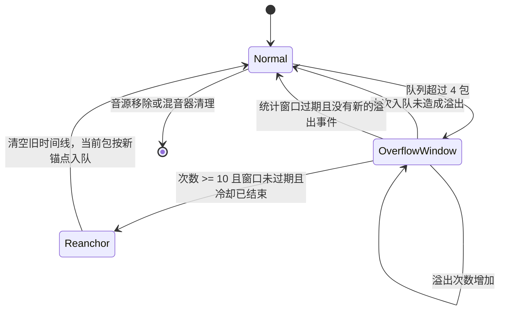

# 麦克风队列溢出恢复设计

## 背景

每个远程麦克风音源最多缓存 4 个 20 ms Opus 包。接收速度短时间高于主机播放速度时，混音器会丢弃最远的未来包。偶发溢出属于正常的实时降级；持续溢出则可能让音源的接收时间线和主机播放时间线长期错位，表现为 PLC 增多、声音断续或播放进度异常。

本机制只负责恢复单个麦克风音源的播放时间线，不负责修复网络、客户端发送节奏或主机调度本身的问题。

## 参数与取舍

| 参数 | 值 | 作用 |
| --- | ---: | --- |
| 单音源最大缓存 | 4 包 | 保持低延迟并限制内存 |
| 溢出统计窗口 | 250 帧（约 5 秒） | 判断溢出是否持续 |
| 重锚阈值 | 10 次溢出 | 避免单个乱序包触发恢复 |
| 重锚冷却时间 | 100 帧（约 2 秒） | 持续故障时允许再次恢复，同时避免频繁清空时间线 |
| 重锚后的 jitter buffer | 2 帧（约 40 ms） | 给新时间线留出稳定的播放缓冲 |

统计窗口和重锚冷却时间是两个独立概念。统计窗口决定“这一轮是否持续溢出”，冷却时间决定“距离上次溢出重锚多久后才允许再次溢出重锚”。冷却时间小于统计窗口，为下一次恢复保留判断机会；只有后续入队仍满足阈值、窗口和冷却条件时才会再次恢复，并非每隔 2 秒或 5 秒固定重锚。跳帧和其他时间线重置会清除冷却状态，因此冷却不是所有重锚路径的全局频率限制。

### 为什么不直接增大 4 包队列

4 个 20 ms 包最多包含约 80 ms 的音频数据。这是包数量上限，不等于能容忍 80 ms 的网络抖动，也不能与 2 帧 jitter buffer 相加计算实际延迟。首帧的播放位置由锚点和 2 帧预缓冲决定，单独增大队列上限不会改变这个位置。

增大队列可以减少短时间批量到包时的丢弃，但还需要考虑：

- 如果发送速度持续高于播放速度，任何有限容量最终都会耗尽；
- 已经过期的包仍会丢弃，超过未来 8 个槽位的包仍会触发已有时间线重置，单独增加容量不能改变这些规则；
- 每个音源会保留更多包及其载荷；如果同时延后播放位置来利用更大的缓冲，才会进一步增加麦克风延迟。

因此本次保持 4 包上限，先处理溢出恢复逻辑。现有汇总日志不足以证明 4 包是最佳容量；后续应依据到包间隔、突发包数、队列占用和可接受的延迟，对比不同容量与预缓冲设置，再决定是否调整。

## 状态流程

## 接收与恢复逻辑

1. 第一次队列溢出时，记录当前主机播放槽位作为统计窗口起点。
2. 在窗口内累计连续溢出次数。一次成功入队未造成溢出时，清除次数和窗口起点；因此不是统计任意 5 秒内全部溢出的总和。
3. 每次检查前，如果统计窗口已经过期，清除旧计数，再由新的溢出事件开启新窗口。
4. 先前已累计 10 次溢出后，在后续包通过序列号、时间线和迟到检查时，若窗口仍有效且距离上一次溢出重锚超过 100 帧（首次无冷却），则：
   - 重置 Opus 解码器和音源时间线；
   - 清空旧队列；
   - 将当前包放到当前播放槽位之后的 2 帧；
   - 清除旧的溢出状态，并记录新的重锚槽位。
5. 主机播放线程跳帧、音源时间线重置或会话清理时，同时清除溢出窗口和重锚冷却状态，避免旧周期影响新周期。

## 用户可见行为

重锚会重置解码器、清空旧队列，并将该音源标记为尚未开始播放。新包等待两个播放槽位，其间该音源不输出，也不会调用 Opus PLC。若只有这一个音源，混音器返回空结果，播放线程不写入该帧；其他活跃音源仍可继续混音。

在正常的 20 ms 调度下，从重锚入队到首次输出约为 40–60 ms，实际听感还受输出设备缓冲和调度影响，不能保证无停顿或最多中断 40 ms。持续溢出期间，仅在后续包满足恢复条件时再次重锚。

如果 `queue_overflow`、`plc` 长时间持续增长，说明网络、客户端发送或主机调度仍然异常，重锚只能限制时间线错误的持续时间，不能替代对根因的处理。

## 验证范围

- 单元测试覆盖持续溢出达到阈值后的重锚。
- 单元测试覆盖重锚后当前包按新锚点播放。
- 单元测试覆盖主机跳帧后的窗口边界，确保旧状态不会错误触发重锚。
- 真实设备验证需要观察长时间串流中的 `queue_overflow`、`reanchors`、`plc` 和 WASAPI 丢帧统计。
