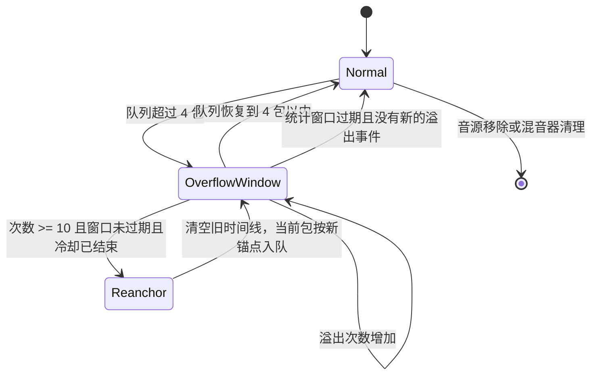

# 麦克风队列溢出恢复设计

## 背景

每个远程麦克风音源最多缓存 4 个 20 ms Opus 包。接收速度短时间高于主机播放速度时，混音器会丢弃最远的未来包。偶发溢出属于正常的实时降级；持续溢出则可能让音源的接收时间线和主机播放时间线长期错位，表现为 PLC 增多、声音断续或播放进度异常。

本机制只负责恢复单个麦克风音源的播放时间线，不负责修复网络、客户端发送节奏或主机调度本身的问题。

## 参数与取舍

| 参数 | 值 | 作用 |
| --- | ---: | --- |
| 单音源最大缓存 | 4 包 | 保持低延迟并限制内存 |
| 溢出统计窗口 | 250 帧（约 5 秒） | 判断溢出是否持续 |
| 重锚阈值 | 10 次溢出 | 避免单个乱序包触发恢复 |
| 重锚冷却时间 | 100 帧（约 2 秒） | 持续故障时允许再次恢复，同时避免频繁清空时间线 |
| 重锚后的 jitter buffer | 2 帧（约 40 ms） | 给新时间线留出稳定的播放缓冲 |

统计窗口和重锚冷却时间是两个独立概念。统计窗口决定“这一轮是否持续溢出”，冷却时间决定“距离上次重锚多久后才允许再次重锚”。冷却时间小于统计窗口，保证持续数十秒的溢出仍能在后续窗口中重新对齐。

## 状态流程

## 接收与恢复逻辑

1. 第一次队列溢出时，记录当前主机播放槽位作为统计窗口起点。
2. 在窗口内累计溢出次数。队列恢复到 4 包以内时，清除次数和窗口起点。
3. 每次检查前，如果统计窗口已经过期，清除旧计数，再由新的溢出事件开启新窗口。
4. 达到 10 次且距离上一次重锚超过 100 帧时：
   - 重置 Opus 解码器和音源时间线；
   - 清空旧队列；
   - 将当前包放到当前播放槽位之后的 2 帧；
   - 清除旧的溢出状态，并记录新的重锚槽位。
5. 主机播放线程跳帧、音源时间线重置或会话清理时，同时清除溢出窗口和重锚冷却状态，避免旧周期影响新周期。

## 用户可见行为

一次重锚最多引入约 40 ms 的重新缓冲。正在播放的音源会使用 Opus PLC 填充这两个槽位，因此通常表现为一次短暂的声音变化。持续溢出时，重锚不会随每个数据包触发；在冷却结束且新的统计窗口再次达到阈值后才会再次恢复。

如果 `queue_overflow`、`plc` 长时间持续增长，说明网络、客户端发送或主机调度仍然异常，重锚只能限制时间线错误的持续时间，不能替代对根因的处理。

## 验证范围

- 单元测试覆盖持续溢出达到阈值后的重锚。
- 单元测试覆盖重锚后当前包按新锚点播放。
- 单元测试覆盖主机跳帧后的窗口边界，确保旧状态不会错误触发重锚。
- 真实设备验证需要观察长时间串流中的 `queue_overflow`、`reanchors`、`plc` 和 WASAPI 丢帧统计。
